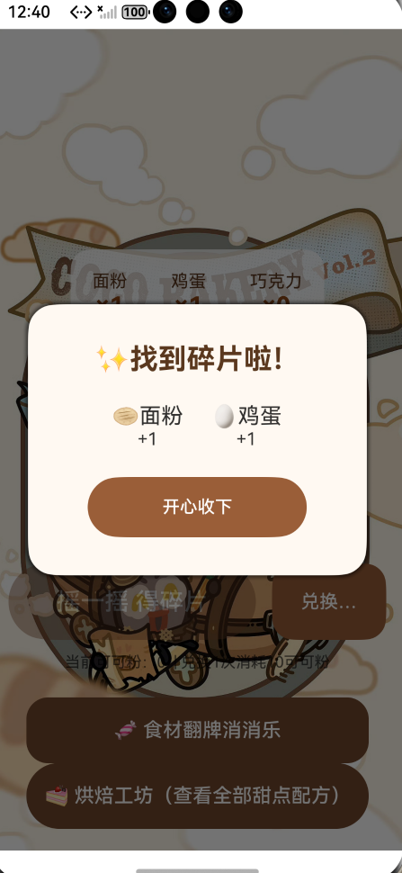
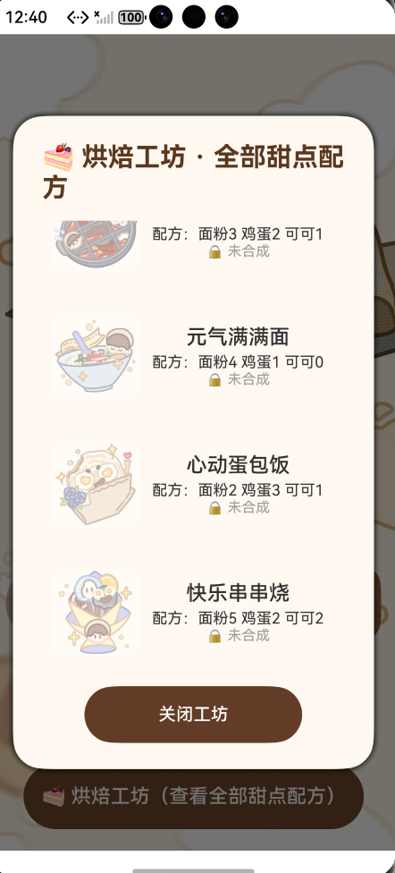
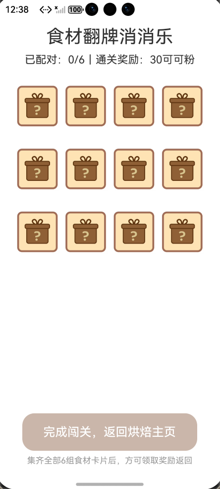
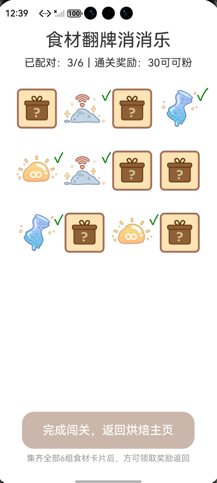
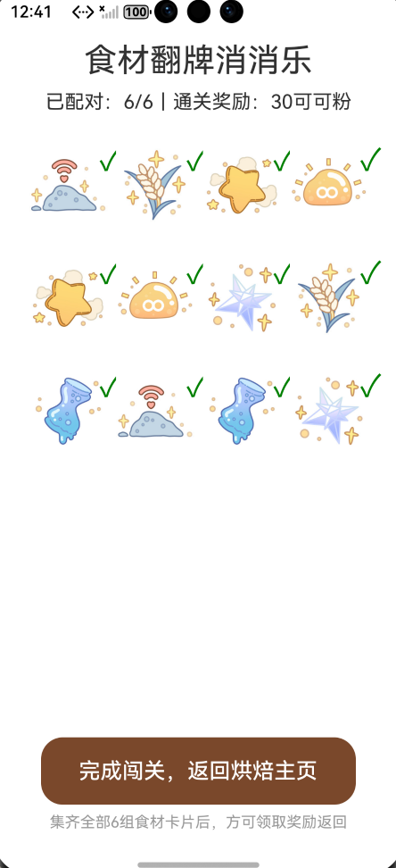

# Coco Bakery - 烘焙小游戏

基于 HarmonyOS 开发的烘焙主题休闲小游戏，支持手机、平板、TV 多端部署，并支持跨设备应用自由流转。

## 游戏介绍

玩家扮演一位烘焙师，通过"摇一摇"抽奖收集食材碎片，在烘焙工坊中合成甜点，还可以挑战食材翻牌消消乐赢取可可粉奖励。

## 截图

| 烘焙主页 | 摇一摇抽奖 | 烘焙工坊 |
|:---:|:---:|:---:|
|  |  |  |

| 消消乐开始 | 消消乐进行中 | 消消乐通关 |
|:---:|:---:|:---:|
|  |  |  |

## 功能特性

### 1. 摇一摇抽奖

- 消耗抽奖机会进行摇一摇，随机获得面粉、鸡蛋、巧克力等食材碎片
- 可可粉可兑换额外抽奖机会（10 可可粉 = 1 次机会）
- 抽奖结果弹窗展示获得的碎片

### 2. 烘焙工坊

- 查看全部甜点配方及所需食材
- 集齐所需食材后可合成甜点，解锁并获得积分奖励
- 4 种甜点配方：
  - 甜蜜华夫饼（面粉3 + 鸡蛋2 + 可可1，奖励 20 积分）
  - 元气满满面（面粉4 + 鸡蛋1，奖励 25 积分）
  - 心动蛋包饭（面粉2 + 鸡蛋3 + 可可1，奖励 30 积分）
  - 快乐串串烧（面粉5 + 鸡蛋2 + 可可2，奖励 35 积分）

### 3. 食材翻牌消消乐

- 12 张卡片（6 对食材），随机打乱排列
- 每次翻开 2 张，配对成功则锁定，失败则翻回
- 全部配对成功后获得 30 可可粉奖励，返回烘焙主页

### 4. 多端部署 & 跨设备流转

- 支持 Phone / Tablet / TV 三种设备类型
- 配置了 `DISTRIBUTED_DATASYNC` 权限，支持跨设备应用自由流转

## 项目结构

```
MyApp/
├── AppScope/                    # 应用全局配置与资源
├── entry/
│   └── src/main/
│       ├── ets/
│       │   ├── entryability/    # 应用入口 Ability
│       │   └── pages/
│       │       ├── Index.ets    # 烘焙抽奖主页
│       │       └── MatchGame/
│       │           └── MatchGame.ets  # 翻牌消消乐页面
│       ├── module.json5         # 模块配置
│       └── resources/           # 图片素材与配置资源
├── hvigor/                      # 构建工具配置
├── build-profile.json5
├── oh-package.json5
└── hvigorfile.ts
```

## 开发环境

- DevEco Studio
- HarmonyOS SDK
- ArkTS / ArkUI
